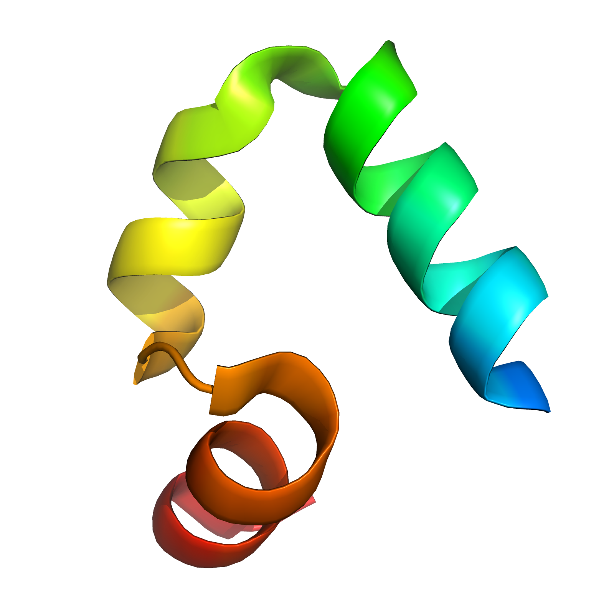
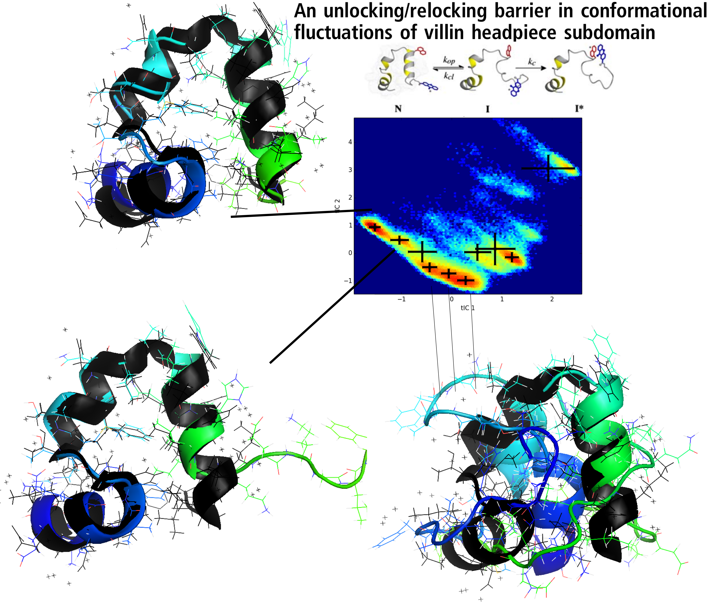
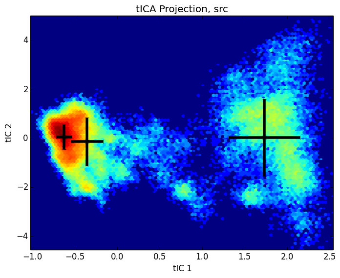
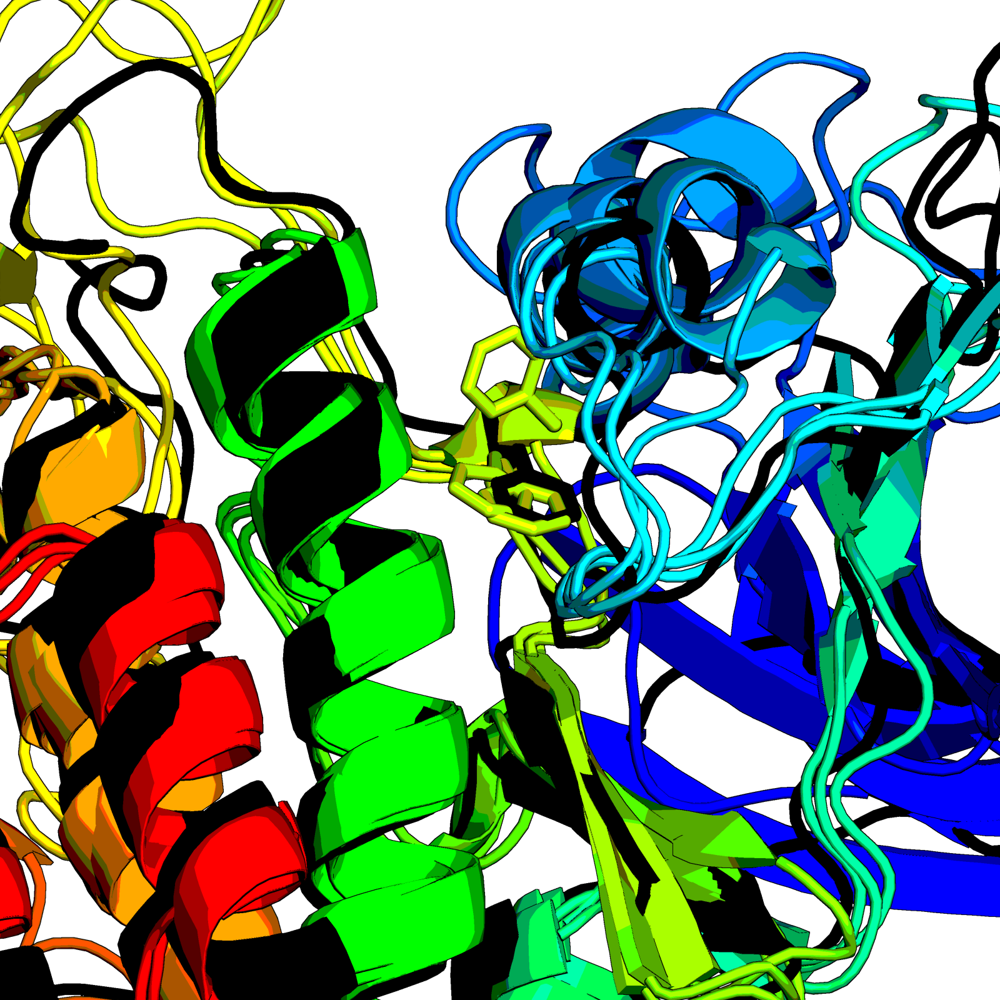

% title: Towards Robust Kinetic Models at the Kinome Scale
% author: Kyle Beauchamp
% author: Chodera Lab

---
title: The Human Kinome

---
title: Ligand Binding and Metastable States

---
title: Physical Simulation of Kinase Inhibitors

<video width="640" height="480" controls loop autoplay>
  <source src="movies/lapitinib.ogg" type="video/ogg">
</video>

 

<footer class="source"> 
Shaw, 2012
</footer>

---
title: Challenges in Simulation

- Precision (Sampling)
- Quantitative Connection to Experiment (Prediction)
- Interpretation (Dimensionality Reduction)

---
title: Markov State Models of Kinetics

- Statistical sampling by short simulations (Sampling)
- Predict arbitrary time-correlation functions (Prediction)
- Few-state models for interpretability (Reduction)

<footer class="source"> 
Chodera, 2007
</footer>

---
title: Introduction to Markov State Models

---
title: Introduction to Markov State Models

---
title: Introduction to Markov State Models

---
title: The Markov State Model Pipeline

---
title: Challenges in MSM Construction

- No score function for overall model
- Hyperparameters in every step 
- Bias variance tradeoff is unwinable (10,000 states)  

---
title: HMMs of Molecular Kinetics

<footer class="source"> 
Prinz, 2013.  McGibbon, 2014.
</footer>

---
title: A HMM Pipeline for Molecular Kinetics

---
title: MSMBuilder, MDTraj, Mixtape (MSMB3)
subtitle: Open-Source, High-Performance Featurization, Modeling, and Analysis

     

<footer class="source">
Contributions from Vijay Pande, Greg Bowman, Xuhui Huang, John Chodera, Sergio Bacallado, Dan Ensign, Vince Voelz, TJ Lane, Lutz Maibaum, Imran Haque, Robert McGibbon, Christian Schwantes, Toni Giorgino, Gianni de Fabritiis
</footer>

---
title: Loading and Saving Trajectories

<pre class="prettyprint" data-lang="python">

import mdtraj as md
import glob

trj0 = md.load("./Trajectories/trj0.h5")
trj0.save("out.pdb")

filenames = sorted(glob.glob("./Trajectories/*.h5"))
trajectories = [md.load(filename, stride=stride) for filename in filenames]

</pre>

---
title: Trajectory Featurization

<pre class="prettyprint" data-lang="python">
import mixtape

featurizer = mixtape.featurizer.AtomPairsFeaturizer([[0, 1],[1, 2], [2, 3]], trj0)
X = featurizer.featurize(trj0)

array([[ 0.10102207,  0.15920012,  0.16530874]], dtype=float32)
</pre>

---
title: Slow Feature Detection with tICA

Goal: Find slowest linear combination of $f_i(t)$

$$C(t) x = \lambda(t) \Sigma x$$

<pre class="prettyprint" data-lang="python">
tica = mixtape.tica.tICA()
map(lambda trj: tica.partial_fit(featurizer.featurize(trj)), trajectories)
X_slow = map(lambda trj: tica.transform(featurizer.featurize(trj)), trajectories)

</pre>

---
title: HMMs of Molecular Kinetics

<pre class="prettyprint" data-lang="python">
model = mixtape.ghmm.GaussianFusionHMM(n_states)
model.fit(X_slow)
</pre>

---
title: Metastable States of the Kinome

---
title: Recovering Known Metastable States

---
title: Recovering Known Metastable States

---
title: Metastable States of src Kinase?

---
title: Metastable States of src Kinase?

---
title: Future Work

- Cross-Validated Likelihood
- Pipelining and Concatenating Featurizers
- Randomized Feature Selection
- Outlier Detection of Bad Trajectories
- Improved Simulation Protocols and Parameters

---
title: Acknowledgements

- Chodera Lab
- Robert McGibbon and MSMBuilder Developers
- Folding@Home + Vijay Pande
