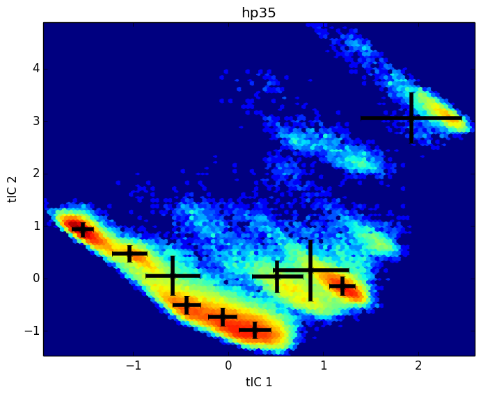

% title: Mapping the Metastable States of the Human Kinome
% author: Kyle Beauchamp
% author: Chodera Lab

---
title: The Human Kinome

<footer class="source"> 
Rix, 2009
</footer>

---
title: Ligand Binding and Metastable States

<footer class="source"> 
Kobilka, 2012
</footer>

---
title: Physical Simulation of Kinase Inhibitors

<video width="640" height="480" controls loop autoplay>
  <source src="movies/lapitinib.ogg" type="video/ogg">
</video>

 

<footer class="source"> 
Shaw, 2012
</footer>

---
title: Challenges in Simulation

- Precision (Sampling)
- Quantitative Connection to Experiment (Prediction)
- Interpretation (Dimensionality Reduction)

---
title: Markov State Models of Kinetics

- Statistical sampling by short simulations (Sampling)
- Predict arbitrary time-correlation functions (Prediction)
- Few-state models for interpretability (Reduction)

<footer class="source"> 
Chodera, 2007
</footer>

---
title: Introduction to Markov State Models

---
title: Introduction to Markov State Models

---
title: Introduction to Markov State Models

---
title: The Markov State Model Pipeline

---
title: Challenges in MSM Construction

- No score function for overall model
- Hyperparameters in every step 
- Bias variance tradeoff is unwinable (10,000 states)  

---
title: HMMs of Molecular Kinetics

<footer class="source"> 
Prinz, 2013.  McGibbon, 2014.
</footer>

---
title: A HMM Pipeline for Molecular Kinetics

---
title: MSMBuilder, MDTraj, Mixtape (MSMB3)
subtitle: High-Performance Featurization and Analysis

     

<footer class="source">
Contributions from Vijay Pande, Greg Bowman, Xuhui Huang, John Chodera, Sergio Bacallado, Dan Ensign, Vince Voelz, TJ Lane, Lutz Maibaum, Imran Haque, Robert McGibbon, Christian Schwantes, Toni Giorgino, Gianni de Fabritiis
</footer>

---
title: Loading Trajectories

<pre class="prettyprint" data-lang="python">

import mdtraj

trj = mdtraj.load("./Trajectories/trj0.h5")

</pre>

---
title: Trajectory Featurization

<pre class="prettyprint" data-lang="python">
import mixtape

featurizer = mixtape.featurizer.AtomPairsFeaturizer([[0, 1],[1, 2], [2, 3]], trj0)
X = featurizer.featurize(trj0)

array([[ 0.10102207,  0.15920012,  0.16530874]], dtype=float32)
</pre>

---
title: Slow Feature Detection with tICA

<pre class="prettyprint" data-lang="python">
tica = mixtape.tica.tICA()
map(lambda trj: tica.partial_fit(featurizer.featurize(trj)), trajectories)
X_slow = map(lambda trj: tica.transform(featurizer.featurize(trj)), trajectories)

</pre>

---
title: HMMs of Molecular Kinetics

<pre class="prettyprint" data-lang="python">
model = mixtape.ghmm.GaussianFusionHMM(n_states)
model.fit(X_slow)
</pre>

---
title: Recovering Known Metastable States

---
title: Recovering Known Metastable States

<footer class="source"> 
Kiefhaber, 2010
</footer>

---
title: Metastable States of src Kinase?

---
title: Metastable States of src Kinase?

---
title: Conclusions

- We are mapping metastable states of the human kinome
- Robust kinetic modeling pipeline recovers known results
- A robot will test our predictions 

---
title: Future Work

- Cross-Validated Likelihood and Model Selection
- Pipelining and Concatenating Featurizers
- Outlier Detection of Bad Trajectories
- Improved Simulation Protocols and Parameters

---
title: Acknowledgements

- Chodera Lab
- Robert McGibbon and MSMBuilder Developers
- Folding@Home + Vijay Pande
